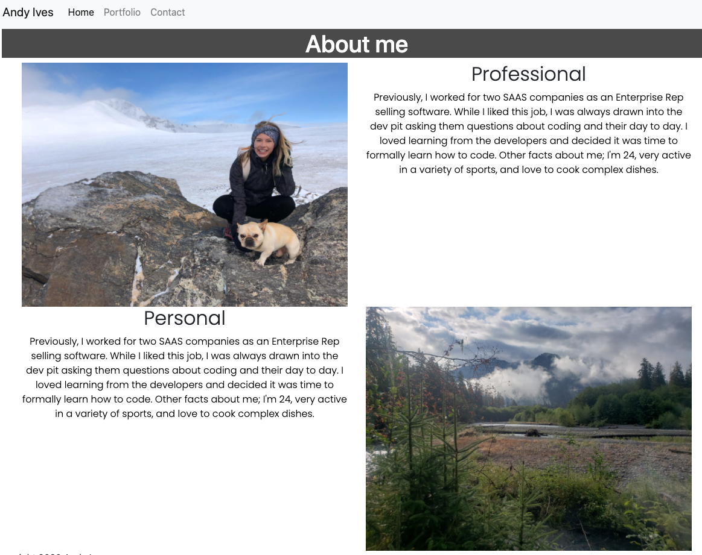
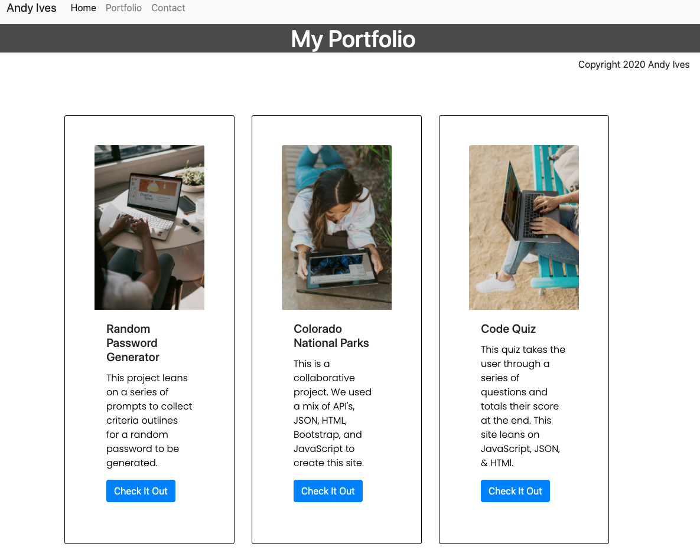
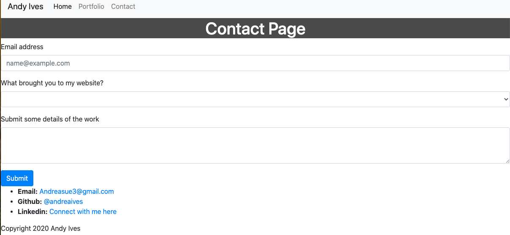

### Andy's Bio 

### Description
This website includes a portfolio page, About Me page, and a contact page. Each page is designed to be responsive and include boostrap snippets. 

### Usage

Welcom to the home page where you can read a little baout me. Visitors to the website have the ability to toggle through the different pages with the nave bar.

Next check out my Portfolio page. Users are able to access my work through buttons.

Finally the contact page will allow users to submit their information as well as have my contact information.

### Technologies Used
The main tech used was JavaScript, HTML, and CSS. This code was created on Visual Studio and renders were checked on Google Chrome. FOr some interactive elements such as the NavBar and the cards I used bootstrap snippets. Additionally, I did use some Google Fonts as well.

### Problems I faced
My biggest problem with this page was the drop down menu was not responsive upon installation. To fix this issue I had the change the data-target tag to match the id. I am unsure why Boostrap did not have it set correctly in the first place.

[Portfolio Link](https://andreaives.github.io/my_bio_site/)

Credits
To all of the goons that dedicated their life to pursuing the art of coding with me.

